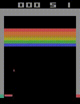
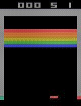

# Breakout-DQN, DRQN, A3C, PPO [PYTORCH]

## Introduction

I wrote a python code that can train an agent to play **Atari Breakout** by 

- Deep Q-Network **[DQN](https://arxiv.org/pdf/1312.5602v1.pdf)**
- Deep Recurrent Q-Network **[DRQN](https://arxiv.org/pdf/1507.06527v4.pdf)**

- Asynchronous Advantage Actor Critic **[A3C](https://arxiv.org/pdf/1602.01783v2.pdf)**
- Proximal Policy Optimization **[PPO](https://arxiv.org/pdf/1707.06347.pdf)**

## Sample Results

     
    <i>A3C result</i>  
     
    <i>PPO result</i>

## Requirements

- Python 3
- Pytorch
- Gym
- OpenCV
